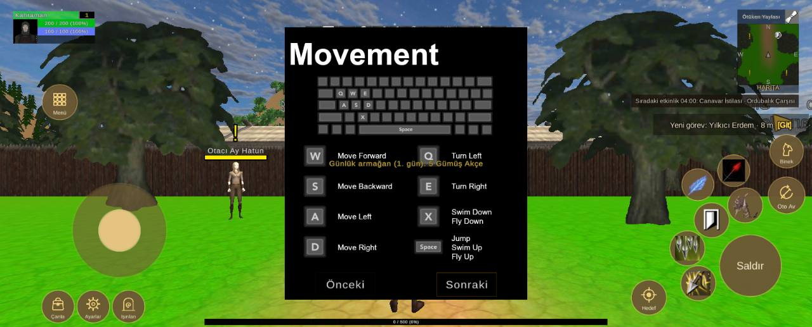
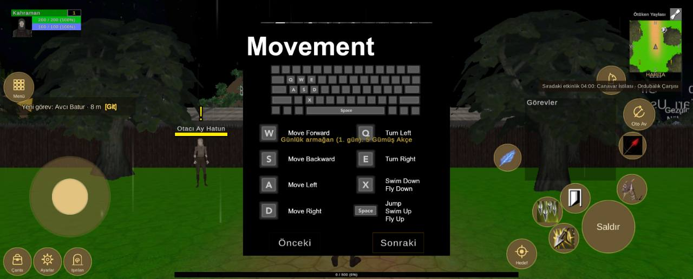
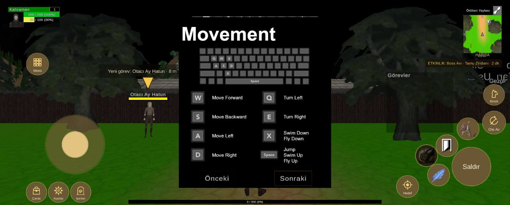

# Arayüz yerleşimi, 1600x646 ekran

Durum: 🔴 açık

| Tekrar | Cihaz | Sürümler | İlk görülme | Son görülme |
|---|---|---|---|---|
| 3 | 1 | 1.0.79 | 09.10.2026 02:43 | 09.10.2026 03:23 |


## İlk rapor

**Arayüz** · sürüm **1.0.79** · Xiaomi 25078RA3EY · Android OS 15 / API-35 (AP3A.240905.015.A2/OS2.0.207.0.VBNTRXM) · ekran 1600x646 · FeaturesDemoZone

### Mesaj
```text
4 çakışma (1600x646)
```

### Ayrıntı
```text
Ekran 1600x646, güvenli alan (74,0 1526x646)
Beceri2 kaydırıldı (-10, -40)
Beceri3 kaydırıldı (-40, -20)
Beceri4 kaydırıldı (20, -20)
Çakışmalar (4):
- düğme Beceri5 ~ QuestTrackerWindow (QuestTrackerWindow/Contents/QuestTrackerPanel)
- düğme Beceri6 ~ QuestTrackerWindow (QuestTrackerWindow/Contents/QuestTrackerPanel)
- düğme Beceri7 ~ QuestTrackerWindow (QuestTrackerWindow/Contents/QuestTrackerPanel)
- düğme Beceri3 ~ düğme Beceri8
Düğmeler:
Hareket (143,98 186x186)
Çanta (83,9 63x63)
Ayarlar (152,9 63x63)
Işınlan (222,9 63x63)
Menü (84,410 68x68)
Saldır (1418,61 121x121)
Beceri1 (1435,206 68x68)
Beceri2 (1368,153 68x68)
Beceri3 (1304,122 68x68)
Beceri4 (1342,61 68x68)
Beceri5 (1415,278 61x61)
Beceri6 (1344,250 61x61)
Beceri7 (1290,197 61x61)
Beceri8 (1261,127 61x61)
Oto Av (1514,224 71x71)
Binek (1518,315 65x65)
Hedef (1245,24 68x68)
Göstergeler:
MiniMap (1453,462 121x165)
PlayerUnitFrame (26,560 162x65)
QuestTrackerWindow (1212,228 210x190)
SystemBar (602,563 396x32)
XPBarPanel (403,4 795x12)
```

<details><summary>Ortam</summary>

```text
tur: arayuz
surum: 1.0.79
cihaz: Xiaomi 25078RA3EY
sistem: Android OS 15 / API-35 (AP3A.240905.015.A2/OS2.0.207.0.VBNTRXM)
grafik: Vulkan / Mali-G52 MC2 / bellek 7665 MB
ekran: 1600x646
ayarlar: kalite -1, çözünürlük 0, gölge 0, fps sınırı 1
sahne: FeaturesDemoZone
oyuncu: seviye 1
sure: 115 sn
```

</details>

<details><summary>Oyunun durumu</summary>

```text
Sürüm 1.0.79 | Xiaomi 25078RA3EY | Android OS 15 / API-35 (AP3A.240905.015.A2/OS2.0.207.0.VBNTRXM)
Vulkan Mali-G52 MC2 | Bellek 7665 MB | 1600x646 | FPS 18 | Süre 112 sn
Kare süresi: işlemci 63.4 ms | ekran kartı 48.4 ms | ekran 60 Hz | hedef 60 | kalite Very Low | çizim 1600x646 (ekran 1600x646, ölçek 1.00) | pil 100%
Sahneler: FeaturesDemoZone
Giriş: dokunmatik var | fare yok | ekran tuşları açık
Son dokunuş: 977,145 -> Panel/Sonra [GunlukArmaganCanvas 28]
Oyuncu karakteri: oluştu (MecanimMale2) | Önizleme karakteri: yok | Önizleme kamerası: kapalı
```

</details>

<details><summary>Son kayıt satırları</summary>

```text
02:43:24 [Warning] [Reklam] onay bilgisi: Publisher misconfiguration: Failed to read publisher's account configuration; no form(s) configured for the input app ID. Verify that you have configured one or more forms for t...
02:41:47 [Log] OyunAyarlari: ilk açılış grafik seviyesi 1 (bellek 7665 MB, Mali-G52 MC2)
```

</details>


## Ekran görüntüleri







## Notlar

09.10.2026 03:23 · 1.0.79 · Xiaomi 25078RA3EY — Arayüz: çakışma yok (1600x646)

```text
Ekran 1600x646, güvenli alan (74,0 1526x646)
Beceri2 kaydırıldı (-10, -10)
Beceri3 kaydırıldı (-20, -20)
Beceri4 kaydırıldı (20, -30)
Çakışmalar (0):
Düğmeler:
Hareket (143,98 186x186)
Çanta (83,9 63x63)
Ayarlar (152,9 63x63)
Işınlan (222,9 63x63)
Menü (84,410 68x68)
Saldır (1418,61 121x121)
Beceri1 (1435,206 68x68)
Beceri2 (1368,177 68x68)
Beceri3 (1320,122 68x68)
Beceri4 (1342,53 68x68)
Beceri5 (1415,278 61x61)
Beceri6 (1344,250 61x61)
Beceri7 (1290,197 61x61)
Beceri8 (1261,127 61x61)
Oto Av (1514,224 71x71)
Binek (1518,315 65x65)
Hedef (1245,24 68x68)
Göstergeler:
MiniMap (1453,462 121x165)
PlayerUnitFrame (26,560 162x65)
SystemBar (602,563 396x32)
XPBarPanel (403,4 795x12)
```

09.10.2026 02:50 · 1.0.79 · Xiaomi 25078RA3EY — Arayüz: 4 çakışma (1600x646)

```text
Ekran 1600x646, güvenli alan (0,0 1526x646)
Beceri1 kaydırıldı (80, -40)
Beceri2 kaydırıldı (-10, -40)
Beceri3 kaydırıldı (-40, -20)
Beceri4 kaydırıldı (20, -20)
Beceri5 kaydırıldı (110, 0)
Beceri6 kaydırıldı (-160, 0)
Oto Av kaydırıldı (0, 150)
Binek kaydırıldı (-80, 140)
Çakışmalar (4):
- düğme Beceri7 ~ QuestTrackerWindow (QuestTrackerWindow/Contents/QuestTrackerPanel)
- düğme Beceri2 ~ düğme Beceri7
- düğme Beceri2 ~ düğme Beceri8
- düğme Beceri3 ~ düğme Beceri8
Düğmeler:
Hareket (69,98 186x186)
Çanta (9,9 63x63)
Ayarlar (78,9 63x63)
Işınlan (148,9 63x63)
Menü (10,410 68x68)
Saldır (1344,61 121x121)
Beceri1 (1425,174 68x68)
Beceri2 (1294,153 68x68)
Beceri3 (1230,122 68x68)
Beceri4 (1268,61 68x68)
Beceri5 (1430,278 61x61)
Beceri6 (1141,250 61x61)
Beceri7 (1290,197 61x61)
Beceri8 (1261,127 61x61)
Oto Av (1440,346 71x71)
Binek (1379,428 65x65)
Hedef (1171,24 68x68)
Göstergeler:
MiniMap (1453,462 121x165)
PlayerUnitFrame (26,560 162x65)
QuestTrackerWindow (1212,228 210x190)
SystemBar (602,563 396x32)
XPBarPanel (403,4 795x12)
```

## Görülmeler (yeniden eskiye)

| Zaman · sürüm · cihaz · harita · oyuncu · ekran |
|---|
| 09.10.2026 03:23 · 1.0.79 · Xiaomi 25078RA3EY · FeaturesDemoZone · seviye 1 · 1600x646 |
| 09.10.2026 02:50 · 1.0.79 · Xiaomi 25078RA3EY · FeaturesDemoZone · seviye 1 · 1600x646 |
| 09.10.2026 02:43 · 1.0.79 · Xiaomi 25078RA3EY · FeaturesDemoZone · seviye 1 · 1600x646 |

Anahtar: `arayuz-1600x646`
