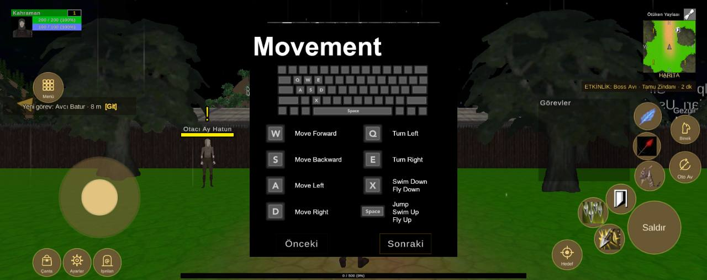

# Arayüz yerleşimi, 1640x652 ekran

Durum: 🔴 açık

| Tekrar | Cihaz | Sürümler | İlk görülme | Son görülme |
|---|---|---|---|---|
| 1 | 1 | 1.0.79 | 09.10.2026 02:43 | 09.10.2026 02:43 |


## İlk rapor

**Arayüz** · sürüm **1.0.79** · Xiaomi 2409BRN2CA · Android OS 16 / API-36 (BP2A.250605.031.A3/OS3.0.301.0.WGTTRXM) · ekran 1640x652 · FeaturesDemoZone

### Mesaj
```text
2 çakışma (1640x652)
```

### Ayrıntı
```text
Ekran 1640x652, güvenli alan (68,0 1572x652)
Beceri2 kaydırıldı (-10, -40)
Beceri3 kaydırıldı (-40, -20)
Beceri4 kaydırıldı (20, -20)
Beceri5 kaydırıldı (20, 0)
Beceri6 kaydırıldı (110, 120)
Çakışmalar (2):
- düğme Beceri7 ~ QuestTrackerWindow (QuestTrackerWindow/Contents/QuestTrackerPanel)
- düğme Beceri3 ~ düğme Beceri8
Düğmeler:
Hareket (137,99 187x187)
Çanta (77,9 64x64)
Ayarlar (147,9 64x64)
Işınlan (217,9 64x64)
Menü (78,414 68x68)
Saldır (1457,61 122x122)
Beceri1 (1473,208 68x68)
Beceri2 (1406,154 68x68)
Beceri3 (1342,123 68x68)
Beceri4 (1380,61 68x68)
Beceri5 (1470,281 62x62)
Beceri6 (1472,350 62x62)
Beceri7 (1327,199 62x62)
Beceri8 (1298,128 62x62)
Oto Av (1554,227 72x72)
Binek (1557,318 65x65)
Hedef (1281,24 68x68)
Göstergeler:
MiniMap (1492,466 122x166)
PlayerUnitFrame (26,565 163x65)
QuestTrackerWindow (1249,230 212x192)
SystemBar (620,568 400x33)
XPBarPanel (419,4 802x12)
```

<details><summary>Ortam</summary>

```text
tur: arayuz
surum: 1.0.79
cihaz: Xiaomi 2409BRN2CA
sistem: Android OS 16 / API-36 (BP2A.250605.031.A3/OS3.0.301.0.WGTTRXM)
grafik: Vulkan / Mali-G52 MC2 / bellek 7664 MB
ekran: 1640x652
ayarlar: kalite -1, çözünürlük 0, gölge 0, fps sınırı 1
sahne: FeaturesDemoZone
oyuncu: seviye 1
sure: 117 sn
```

</details>

<details><summary>Oyunun durumu</summary>

```text
Sürüm 1.0.79 | Xiaomi 2409BRN2CA | Android OS 16 / API-36 (BP2A.250605.031.A3/OS3.0.301.0.WGTTRXM)
Vulkan Mali-G52 MC2 | Bellek 7664 MB | 1640x652 | FPS 18 | Süre 113 sn
Kare süresi: işlemci 58.4 ms | ekran kartı 47.7 ms | ekran 60 Hz | hedef 60 | kalite Very Low | çizim 1640x652 (ekran 1640x652, ölçek 1.00) | pil 100%
Sahneler: FeaturesDemoZone
Giriş: dokunmatik var | fare yok | ekran tuşları açık
Son dokunuş: 990,145 -> Panel/Sonra [GunlukArmaganCanvas 28]
Oyuncu karakteri: oluştu (MecanimMale2) | Önizleme karakteri: yok | Önizleme kamerası: kapalı
```

</details>

<details><summary>Son kayıt satırları</summary>

```text
02:43:22 [Warning] [Reklam] onay bilgisi: Publisher misconfiguration: Failed to read publisher's account configuration; no form(s) configured for the input app ID. Verify that you have configured one or more forms for t...
02:41:44 [Log] OyunAyarlari: ilk açılış grafik seviyesi 1 (bellek 7664 MB, Mali-G52 MC2)
```

</details>


## Ekran görüntüleri



## Görülmeler (yeniden eskiye)

| Zaman · sürüm · cihaz · harita · oyuncu · ekran |
|---|
| 09.10.2026 02:43 · 1.0.79 · Xiaomi 2409BRN2CA · FeaturesDemoZone · seviye 1 · 1640x652 |

Anahtar: `arayuz-1640x652`
