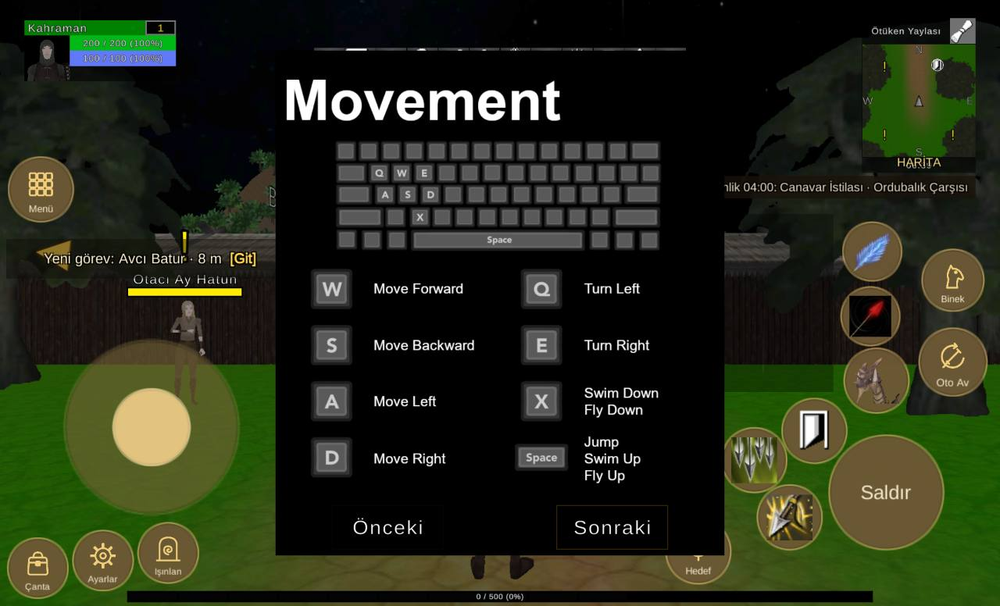

# Arayüz yerleşimi, 1920x1164 ekran

Durum: 🔴 açık

| Tekrar | Cihaz | Sürümler | İlk görülme | Son görülme |
|---|---|---|---|---|
| 1 | 1 | 1.0.79 | 09.10.2026 02:47 | 09.10.2026 02:47 |


## İlk rapor

**Arayüz** · sürüm **1.0.79** · samsung SM-T547 · Android OS 11 / API-30 (RP1A.200720.012/T547JXS3CWJ3_B2BF) · ekran 1920x1164 · FeaturesDemoZone

### Mesaj
```text
2 çakışma (1920x1164)
```

### Ayrıntı
```text
Ekran 1920x1164, güvenli alan (0,0 1920x1164)
Ayarlar kaydırıldı (0, 10)
Işınlan kaydırıldı (0, 20)
Beceri2 kaydırıldı (-10, -40)
Beceri3 kaydırıldı (-40, -20)
Beceri4 kaydırıldı (20, -20)
Beceri5 kaydırıldı (20, 0)
Beceri6 kaydırıldı (110, 120)
Çakışmalar (2):
- düğme Beceri7 ~ QuestTrackerWindow (QuestTrackerWindow/Contents/QuestTrackerPanel)
- düğme Beceri3 ~ düğme Beceri8
Düğmeler:
Hareket (124,176 335x335)
Çanta (16,16 113x113)
Ayarlar (141,31 113x113)
Işınlan (266,45 113x113)
Menü (17,739 122x122)
Saldır (1593,109 218x218)
Beceri1 (1622,372 122x122)
Beceri2 (1503,275 122x122)
Beceri3 (1387,219 122x122)
Beceri4 (1455,109 122x122)
Beceri5 (1616,501 111x111)
Beceri6 (1619,626 111x111)
Beceri7 (1362,355 111x111)
Beceri8 (1309,228 111x111)
Oto Av (1766,404 128x128)
Binek (1772,567 116x116)
Hedef (1280,44 122x122)
Göstergeler:
MiniMap (1655,832 218x297)
PlayerUnitFrame (47,1008 291x116)
QuestTrackerWindow (1222,411 378x342)
SystemBar (603,1014 714x58)
XPBarPanel (244,7 1432x22)
```

<details><summary>Ortam</summary>

```text
tur: arayuz
surum: 1.0.79
cihaz: samsung SM-T547
sistem: Android OS 11 / API-30 (RP1A.200720.012/T547JXS3CWJ3_B2BF)
grafik: Vulkan / Adreno (TM) 615 / bellek 3643 MB
ekran: 1920x1164
ayarlar: kalite 0, çözünürlük 2, gölge 0, fps sınırı 1
sahne: FeaturesDemoZone
oyuncu: seviye 1
sure: 124 sn
```

</details>

<details><summary>Oyunun durumu</summary>

```text
Sürüm 1.0.79 | samsung SM-T547 | Android OS 11 / API-30 (RP1A.200720.012/T547JXS3CWJ3_B2BF)
Vulkan Adreno (TM) 615 | Bellek 3643 MB | 1920x1164 | FPS 17 | Süre 121 sn
Kare süresi: işlemci 61.6 ms | ekran kartı 49.7 ms | ekran 60 Hz | hedef 60 | kalite Low | çizim 1536x931 (ekran 1920x1164, ölçek 0.80) | pil 100%
Sahneler: FeaturesDemoZone
Giriş: dokunmatik var | fare bağlı | ekran tuşları açık
Son dokunuş: 1250,71 -> oyun dünyası
Oyuncu karakteri: oluştu (MecanimMale2) | Önizleme karakteri: yok | Önizleme kamerası: kapalı
```

</details>

<details><summary>Son kayıt satırları</summary>

```text
02:47:45 [Log] OyunAyarlari: Akıcılık için çözünürlük Orta yapıldı (16 FPS ölçüldü).
02:47:21 [Log] OyunAyarlari: Akıcılık için grafik kalitesi Düşük yapıldı (13 FPS ölçüldü).
02:46:54 [Warning] [Reklam] onay bilgisi: Publisher misconfiguration: Failed to read publisher's account configuration; no form(s) configured for the input app ID. Verify that you have configured one or more forms for t...
02:45:58 [Warning] [Bellek] cihazın belleği azaldı (3643 MB): varlıklar boşaltıldı, dokular küçültüldü (1. uyarı)
02:45:57 [Bellek] Cihazın belleği azaldı (3643 MB toplam)
02:45:51 [Log] OyunAyarlari: ilk açılış grafik seviyesi 1 (bellek 3643 MB, Adreno (TM) 615)
```

</details>


## Ekran görüntüleri



## Görülmeler (yeniden eskiye)

| Zaman · sürüm · cihaz · harita · oyuncu · ekran |
|---|
| 09.10.2026 02:47 · 1.0.79 · samsung SM-T547 · FeaturesDemoZone · seviye 1 · 1920x1164 |

Anahtar: `arayuz-1920x1164`
