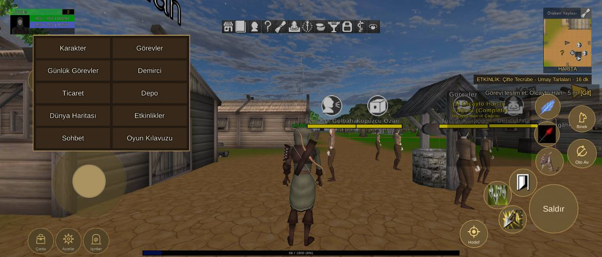

# Arayüz yerleşimi, 2340x1001 ekran

Durum: 🔴 açık

| Tekrar | Cihaz | Sürümler | İlk görülme | Son görülme |
|---|---|---|---|---|
| 2 | 1 | 1.0.78, 1.0.79 | 07.10.2026 22:29 | 08.10.2026 02:26 |


## İlk rapor

**Arayüz** · sürüm **1.0.78** · samsung SM-S938B · Android OS 16 / API-36 (BP4A.251205.006/S938BXXSBCZG3) · ekran 2340x1001 · FeaturesDemoZone

### Mesaj
```text
2 çakışma (2340x1001)
```

### Ayrıntı
```text
Ekran 2340x1001, güvenli alan (96,0 2244x1001)
Beceri2 kaydırıldı (-10, -40)
Beceri3 kaydırıldı (-40, -20)
Beceri4 kaydırıldı (20, -20)
Beceri5 kaydırıldı (20, 0)
Beceri6 kaydırıldı (110, 120)
Çakışmalar (2):
- düğme Beceri7 ~ QuestTrackerWindow (QuestTrackerWindow/Contents/QuestTrackerPanel)
- düğme Beceri3 ~ düğme Beceri8
Düğmeler:
Hareket (202,151 288x288)
Çanta (110,14 98x98)
Ayarlar (217,14 98x98)
Işınlan (325,14 98x98)
Menü (111,636 105x105)
Saldır (2058,94 188x188)
Beceri1 (2084,320 105x105)
Beceri2 (1981,237 105x105)
Beceri3 (1882,188 105x105)
Beceri4 (1940,94 105x105)
Beceri5 (2079,431 95x95)
Beceri6 (2082,538 95x95)
Beceri7 (1860,305 95x95)
Beceri8 (1815,196 95x95)
Oto Av (2207,348 110x110)
Binek (2212,488 100x100)
Hedef (1789,38 105x105)
Göstergeler:
MiniMap (2112,716 188x255)
PlayerUnitFrame (40,867 250x100)
QuestTrackerWindow (1739,353 325x294)
SystemBar (863,872 614x50)
XPBarPanel (554,6 1231x19)
```

<details><summary>Ortam</summary>

```text
tur: arayuz
surum: 1.0.78
cihaz: samsung SM-S938B
sistem: Android OS 16 / API-36 (BP4A.251205.006/S938BXXSBCZG3)
grafik: Vulkan / Adreno (TM) 830 / bellek 11113 MB
ekran: 2340x1001
ayarlar: kalite 0, çözünürlük 0, gölge 0, fps sınırı 1
sahne: FeaturesDemoZone
oyuncu: seviye 2
sure: 56 sn
```

</details>

<details><summary>Oyunun durumu</summary>

```text
Sürüm 1.0.78 | samsung SM-S938B | Android OS 16 / API-36 (BP4A.251205.006/S938BXXSBCZG3)
Vulkan Adreno (TM) 830 | Bellek 11113 MB | 2340x1001 | FPS 115 | Süre 54 sn
Kare süresi: işlemci 8.7 ms | ekran kartı 5.1 ms | ekran 120 Hz | hedef 500 | kalite Low | çizim 2340x1001 (ekran 2340x1001, ölçek 1.00) | pil 63%
Sahneler: MovedObjectsHolder FeaturesDemoZone
Giriş: dokunmatik var | fare bağlı | ekran tuşları açık
Son dokunuş: 791,805 -> Kart/X [GelisimCanvas 27]
Oyuncu karakteri: oluştu (MecanimMale205) | Önizleme karakteri: yok | Önizleme kamerası: kapalı
```

</details>

<details><summary>Son kayıt satırları</summary>

```text
22:29:22 [Warning] [Reklam] onay bilgisi: Publisher misconfiguration: Failed to read publisher's account configuration; no form(s) configured for the input app ID. Verify that you have configured one or more forms for t...
```

</details>


## Ekran görüntüleri



## Notlar

08.10.2026 02:26 · 1.0.79 · samsung SM-S938B — Arayüz: 2 çakışma (2340x1001)

```text
Ekran 2340x1001, güvenli alan (96,0 2244x1001)
Beceri2 kaydırıldı (-10, -40)
Beceri3 kaydırıldı (-40, -20)
Beceri4 kaydırıldı (20, -20)
Beceri5 kaydırıldı (20, 0)
Beceri6 kaydırıldı (110, 120)
Çakışmalar (2):
- düğme Beceri7 ~ QuestTrackerWindow (QuestTrackerWindow/Contents/QuestTrackerPanel)
- düğme Beceri3 ~ düğme Beceri8
Düğmeler:
Hareket (202,151 288x288)
Çanta (110,14 98x98)
Ayarlar (217,14 98x98)
Işınlan (325,14 98x98)
Menü (111,636 105x105)
Saldır (2058,94 188x188)
Beceri1 (2084,320 105x105)
Beceri2 (1981,237 105x105)
Beceri3 (1882,188 105x105)
Beceri4 (1940,94 105x105)
Beceri5 (2079,431 95x95)
Beceri6 (2082,538 95x95)
Beceri7 (1860,305 95x95)
Beceri8 (1815,196 95x95)
Oto Av (2207,348 110x110)
Binek (2212,488 100x100)
Hedef (1789,38 105x105)
Göstergeler:
MiniMap (2112,716 188x255)
PlayerUnitFrame (40,867 250x100)
QuestTrackerWindow (1739,353 325x294)
SystemBar (863,872 614x50)
XPBarPanel (554,6 1231x19)
```

## Görülmeler (yeniden eskiye)

| Zaman · sürüm · cihaz · harita · oyuncu · ekran |
|---|
| 08.10.2026 02:26 · 1.0.79 · samsung SM-S938B · FeaturesDemoZone · seviye 1 · 2340x1001 |
| 07.10.2026 22:29 · 1.0.78 · samsung SM-S938B · FeaturesDemoZone · seviye 2 · 2340x1001 |

Anahtar: `arayuz-2340x1001`
