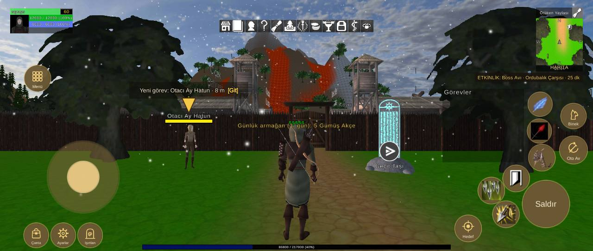

# Arayüz yerleşimi, 2340x990 ekran

Durum: 🔴 açık

| Tekrar | Cihaz | Sürümler | İlk görülme | Son görülme |
|---|---|---|---|---|
| 1 | 1 | 1.0.79 | 08.10.2026 22:20 | 08.10.2026 22:20 |


## İlk rapor

**Arayüz** · sürüm **1.0.79** · samsung SM-S911B · Android OS 16 / API-36 (BP2A.250605.031.A3/S911BXXS8EYK5) · ekran 2340x990 · FeaturesDemoZone

### Mesaj
```text
2 çakışma (2340x990)
```

### Ayrıntı
```text
Ekran 2340x990, güvenli alan (81,0 2259x990)
Beceri2 kaydırıldı (-10, -40)
Beceri3 kaydırıldı (-40, -20)
Beceri4 kaydırıldı (20, -20)
Beceri5 kaydırıldı (20, 0)
Beceri6 kaydırıldı (110, 120)
Çakışmalar (2):
- düğme Beceri7 ~ QuestTrackerWindow (QuestTrackerWindow/Contents/QuestTrackerPanel)
- düğme Beceri3 ~ düğme Beceri8
Düğmeler:
Hareket (186,150 285x285)
Çanta (95,14 97x97)
Ayarlar (201,14 97x97)
Işınlan (307,14 97x97)
Menü (96,629 104x104)
Saldır (2062,93 186x186)
Beceri1 (2086,316 104x104)
Beceri2 (1985,234 104x104)
Beceri3 (1887,186 104x104)
Beceri4 (1945,93 104x104)
Beceri5 (2081,426 94x94)
Beceri6 (2084,532 94x94)
Beceri7 (1865,302 94x94)
Beceri8 (1821,194 94x94)
Oto Av (2209,344 109x109)
Binek (2214,483 99x99)
Hedef (1796,37 104x104)
Göstergeler:
MiniMap (2115,708 186x252)
PlayerUnitFrame (40,858 248x99)
QuestTrackerWindow (1746,350 322x291)
SystemBar (866,863 608x50)
XPBarPanel (561,6 1218x19)
```

<details><summary>Ortam</summary>

```text
tur: arayuz
surum: 1.0.79
cihaz: samsung SM-S911B
sistem: Android OS 16 / API-36 (BP2A.250605.031.A3/S911BXXS8EYK5)
grafik: Vulkan / Adreno (TM) 740 / bellek 7073 MB
ekran: 2340x990
ayarlar: kalite -1, çözünürlük 0, gölge 0, fps sınırı 1
sahne: FeaturesDemoZone
oyuncu: seviye 60
sure: 50 sn
```

</details>

<details><summary>Oyunun durumu</summary>

```text
Sürüm 1.0.79 | samsung SM-S911B | Android OS 16 / API-36 (BP2A.250605.031.A3/S911BXXS8EYK5)
Vulkan Adreno (TM) 740 | Bellek 7073 MB | 2340x990 | FPS 83 | Süre 47 sn
Kare süresi: işlemci 14.2 ms | ekran kartı 9.7 ms | ekran 120 Hz | hedef 500 | kalite Very Low | çizim 2340x990 (ekran 2340x990, ölçek 1.00) | pil 30%
Sahneler: MovedObjectsHolder FeaturesDemoZone
Giriş: dokunmatik var | fare bağlı | ekran tuşları açık
Son dokunuş: 1155,213 -> Panel/Armağanı Al [GunlukArmaganCanvas 28]
Oyuncu karakteri: oluştu (MecanimMale209) | Önizleme karakteri: yo…
```

</details>

<details><summary>Son kayıt satırları</summary>

```text
22:20:35 [Warning] [Reklam] onay bilgisi: Publisher misconfiguration: Failed to read publisher's account configuration; no form(s) configured for the input app ID. Verify that you have configured one or more forms for t...
```

</details>


## Ekran görüntüleri



## Görülmeler (yeniden eskiye)

| Zaman · sürüm · cihaz · harita · oyuncu · ekran |
|---|
| 08.10.2026 22:20 · 1.0.79 · samsung SM-S911B · FeaturesDemoZone · seviye 60 · 2340x990 |

Anahtar: `arayuz-2340x990`
