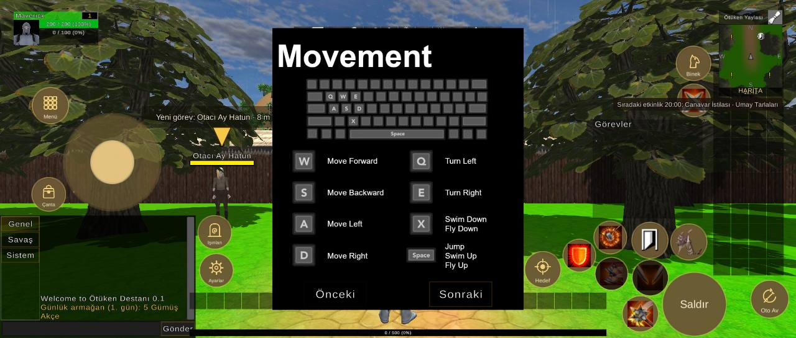
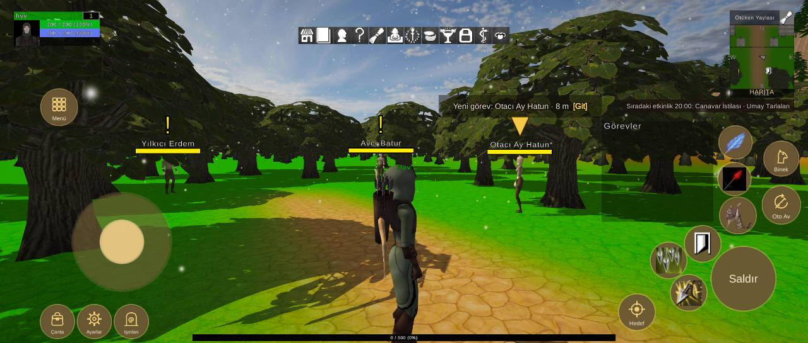

# Arayüz yerleşimi, 2340x996 ekran

Durum: 🔴 açık

| Tekrar | Cihaz | Sürümler | İlk görülme | Son görülme |
|---|---|---|---|---|
| 2 | 2 | 1.0.79 | 08.10.2026 18:46 | 08.10.2026 19:40 |


## İlk rapor

**Arayüz** · sürüm **1.0.79** · samsung SM-S948B · Android OS 16 / API-36 (BP4A.251205.006/S948BXXS4AZHL) · ekran 2340x996 · FeaturesDemoZone

### Mesaj
```text
2 çakışma (2340x996)
```

### Ayrıntı
```text
Ekran 2340x996, güvenli alan (104,0 2236x996)
Beceri2 kaydırıldı (-10, -40)
Beceri3 kaydırıldı (-40, -20)
Beceri4 kaydırıldı (20, -20)
Beceri5 kaydırıldı (20, 0)
Beceri6 kaydırıldı (110, 120)
Çakışmalar (2):
- düğme Beceri7 ~ QuestTrackerWindow (QuestTrackerWindow/Contents/QuestTrackerPanel)
- düğme Beceri3 ~ düğme Beceri8
Düğmeler:
Hareket (210,151 286x286)
Çanta (118,14 97x97)
Ayarlar (225,14 97x97)
Işınlan (332,14 97x97)
Menü (119,632 105x105)
Saldır (2060,93 187x187)
Beceri1 (2085,318 105x105)
Beceri2 (1983,236 105x105)
Beceri3 (1884,187 105x105)
Beceri4 (1942,94 105x105)
Beceri5 (2080,429 95x95)
Beceri6 (2083,535 95x95)
Beceri7 (1862,304 95x95)
Beceri8 (1818,196 95x95)
Oto Av (2208,346 110x110)
Binek (2213,486 100x100)
Hedef (1792,37 105x105)
Göstergeler:
MiniMap (2113,712 187x254)
PlayerUnitFrame (40,863 249x100)
QuestTrackerWindow (1742,352 324x293)
SystemBar (864,868 611x50)
XPBarPanel (557,6 1225x19)
```

<details><summary>Ortam</summary>

```text
tur: arayuz
surum: 1.0.79
cihaz: samsung SM-S948B
sistem: Android OS 16 / API-36 (BP4A.251205.006/S948BXXS4AZHL)
grafik: Vulkan / Adreno (TM) 840 / bellek 15120 MB
ekran: 2340x996
ayarlar: kalite 3, çözünürlük 0, gölge 0, fps sınırı 1
sahne: FeaturesDemoZone
oyuncu: seviye 1
sure: 40 sn
```

</details>

<details><summary>Oyunun durumu</summary>

```text
Sürüm 1.0.79 | samsung SM-S948B | Android OS 16 / API-36 (BP4A.251205.006/S948BXXS4AZHL)
Vulkan Adreno (TM) 840 | Bellek 15120 MB | 2340x996 | FPS 55 | Süre 37 sn
Kare süresi: işlemci 20.9 ms | ekran kartı 17.3 ms | ekran 60 Hz | hedef 60 | kalite Ultra | çizim 3840x1634 (ekran 2340x996, ölçek 1.64) | pil 46%
Sahneler: FeaturesDemoZone
Giriş: dokunmatik var | fare bağlı | ekran tuşları açık
Son dokunuş: 407,301 -> MobileHudCanvas/MoveStick [MobileHudCanvas 5]
Oyuncu karakteri: oluştu (MecanimMale2) | Önizleme karakteri: yok | Önizleme kamerası: kapalı
```

</details>

<details><summary>Son kayıt satırları</summary>

```text
18:46:27 [Warning] [Reklam] onay bilgisi: Publisher misconfiguration: Failed to read publisher's account configuration; no form(s) configured for the input app ID. Verify that you have configured one or more forms for t...
```

</details>


## Ekran görüntüleri





## Notlar

08.10.2026 19:40 · 1.0.79 · samsung SM-S901E — Arayüz: 6 çakışma (2340x996)

```text
Ekran 2340x996, güvenli alan (81,0 2259x996)
Hareket kaydırıldı (0, 180)
Çanta kaydırıldı (0, 290)
Ayarlar kaydırıldı (310, 110)
Işınlan kaydırıldı (220, 200)
Saldır kaydırıldı (-90, -70)
Beceri1 kaydırıldı (-90, -70)
Beceri2 kaydırıldı (-110, -40)
Beceri3 kaydırıldı (-60, -70)
Beceri4 kaydırıldı (-70, -80)
Beceri5 kaydırıldı (-50, 180)
Beceri6 kaydırıldı (-160, -110)
Beceri7 kaydırıldı (-90, -130)
Beceri8 kaydırıldı (-130, 0)
Oto Av kaydırıldı (0, -230)
Binek kaydırıldı (-180, 220)
Hedef kaydırıldı (-200, 90)
Çakışmalar (6):
- AbilityBar5 | MiniMap  (SideActionBars/AbilityBar5/ActionButton1 ~ MiniMapPanel/ContentPanel/MiniMapPanel/MiniMapOutline)
- AbilityBar6 | MiniMap  (SideActionBars/AbilityBar6/ActionButton1 ~ MiniMapPanel/ContentPanel/MiniMapPanel/MiniMapOutline)
- AbilityBar7 | MiniMap  (SideActionBars/AbilityBar7/ActionButton1 ~ MiniMapPanel/ContentPanel/MiniMapPanel/MiniMapOutline)
- AbilityBar8 | MiniMap  (SideActionBars/AbilityBar8/ActionButton1 ~ MiniMapPanel/ContentPanel/MiniMapPanel/MiniMapOutline)
- MessageLogWindow | XPBarPanel  (MessageLogWindow/Contents/MessageLogPanel ~ XPBarPanel)
- AbilityBar2 | MessageLogWindow  (MessageLogWindow/Contents/MessageLogPanel ~ BottomActionBars/TopRow/AbilityBar2/ActionButton1)
Düğmeler:
Hareket (187,375 286x286)
Çanta (95,375 97x97)
Ayarlar (588,151 97x97)
Işınlan (583,263 97x97)
Menü (96,632 105x105)
Saldır (1948,6 187x187)
Beceri1 (1973…
```

## Görülmeler (yeniden eskiye)

| Zaman · sürüm · cihaz · harita · oyuncu · ekran |
|---|
| 08.10.2026 19:40 · 1.0.79 · samsung SM-S901E · FeaturesDemoZone · seviye 1 · 2340x996 |
| 08.10.2026 18:46 · 1.0.79 · samsung SM-S948B · FeaturesDemoZone · seviye 1 · 2340x996 |

Anahtar: `arayuz-2340x996`
