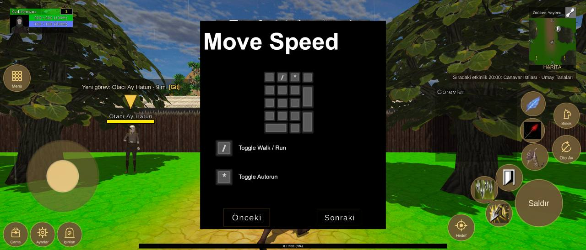

# Arayüz yerleşimi, 2608x1116 ekran

Durum: 🔴 açık

| Tekrar | Cihaz | Sürümler | İlk görülme | Son görülme |
|---|---|---|---|---|
| 1 | 1 | 1.0.79 | 08.10.2026 19:20 | 08.10.2026 19:20 |


## İlk rapor

**Arayüz** · sürüm **1.0.79** · Xiaomi 2312CRAD3C · Android OS 14 / API-34 (UKQ1.231003.002/V816.0.6.0.UNRMIXX) · ekran 2608x1116 · FeaturesDemoZone

### Mesaj
```text
2 çakışma (2608x1116)
```

### Ayrıntı
```text
Ekran 2608x1116, güvenli alan (0,0 2608x1116)
Beceri2 kaydırıldı (-10, -40)
Beceri3 kaydırıldı (-40, -20)
Beceri4 kaydırıldı (20, -20)
Beceri5 kaydırıldı (20, 0)
Beceri6 kaydırıldı (110, 120)
Çakışmalar (2):
- düğme Beceri7 ~ QuestTrackerWindow (QuestTrackerWindow/Contents/QuestTrackerPanel)
- düğme Beceri3 ~ düğme Beceri8
Düğmeler:
Hareket (119,169 321x321)
Çanta (15,15 109x109)
Ayarlar (135,15 109x109)
Işınlan (255,15 109x109)
Menü (17,709 117x117)
Saldır (2294,105 209x209)
Beceri1 (2322,356 117x117)
Beceri2 (2208,264 117x117)
Beceri3 (2097,210 117x117)
Beceri4 (2162,105 117x117)
Beceri5 (2316,480 106x106)
Beceri6 (2320,600 106x106)
Beceri7 (2073,340 106x106)
Beceri8 (2023,219 106x106)
Oto Av (2460,388 123x123)
Binek (2466,544 112x112)
Hedef (1994,42 117x117)
Göstergeler:
MiniMap (2354,798 209x285)
PlayerUnitFrame (45,967 279x112)
QuestTrackerWindow (1938,394 363x328)
SystemBar (962,972 685x56)
XPBarPanel (618,7 1373x21)
```

<details><summary>Ortam</summary>

```text
tur: arayuz
surum: 1.0.79
cihaz: Xiaomi 2312CRAD3C
sistem: Android OS 14 / API-34 (UKQ1.231003.002/V816.0.6.0.UNRMIXX)
grafik: Vulkan / Adreno (TM) 710 / bellek 11279 MB
ekran: 2608x1116
ayarlar: kalite 3, çözünürlük 0, gölge 0, fps sınırı 1
sahne: FeaturesDemoZone
oyuncu: seviye 1
sure: 48 sn
```

</details>

<details><summary>Oyunun durumu</summary>

```text
Sürüm 1.0.79 | Xiaomi 2312CRAD3C | Android OS 14 / API-34 (UKQ1.231003.002/V816.0.6.0.UNRMIXX)
Vulkan Adreno (TM) 710 | Bellek 11279 MB | 2608x1116 | FPS 10 | Süre 45 sn
Kare süresi: işlemci 170.6 ms | ekran kartı 106974700000.0 ms | ekran 60 Hz | hedef 60 | kalite Ultra | çizim 3840x1643 (ekran 2608x1116, ölçek 1.47) | pil 23%
Sahneler: FeaturesDemoZone
Giriş: dokunmatik var | fare yok | ekran tuşları açık
Son dokunuş: 1529,168 -> ButtonContainer/NextButton [SystemMenuUICanvas 19]
Oyuncu karakteri: oluştu (MecanimMale2) | Önizleme karakteri: yo…
```

</details>

<details><summary>Son kayıt satırları</summary>

```text
19:20:10 [Warning] [Reklam] onay bilgisi: Publisher misconfiguration: Failed to read publisher's account configuration; no form(s) configured for the input app ID. Verify that you have configured one or more forms for t...
19:19:34 [Log] OyunAyarlari: 4K açıldı (Adreno (TM) 710, bellek 11279 MB)
```

</details>


## Ekran görüntüleri



## Görülmeler (yeniden eskiye)

| Zaman · sürüm · cihaz · harita · oyuncu · ekran |
|---|
| 08.10.2026 19:20 · 1.0.79 · Xiaomi 2312CRAD3C · FeaturesDemoZone · seviye 1 · 2608x1116 |

Anahtar: `arayuz-2608x1116`
