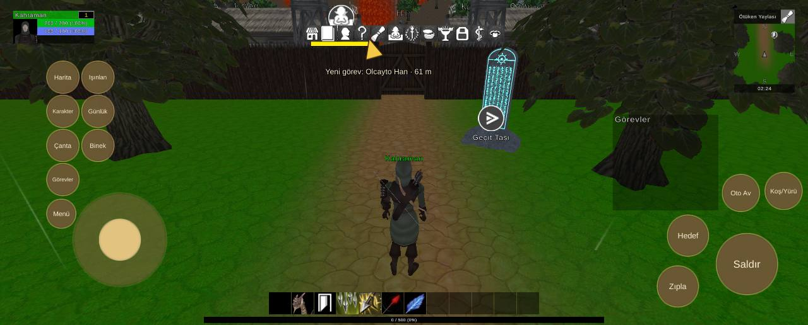

# Arayüz yerleşimi, 2664x1073 ekran

Durum: ✅ düzeltildi (0.1.32)

| Tekrar | Cihaz | Sürümler | İlk görülme | Son görülme |
|---|---|---|---|---|
| 1 | 1 | 0.1.27 | 04.10.2026 14:15 | 04.10.2026 14:15 |


## İlk rapor

**Arayüz** · sürüm **0.1.27** · HONOR REA-NX9 · Android OS 15 / API-35 (HONORREA-N39/9.0.0.206C94E10R2P1) · ekran 2664x1073 · FeaturesDemoZone

### Mesaj
```text
1 çakışma (2664x1073)
```

### Ayrıntı
```text
Ekran 2664x1073, güvenli alan (127,0 2537x1073)
Düğmeler yerinde.
Çakışmalar (1):
- MiniMap | QuestTrackerWindow  (MiniMapGraphic/MiniMapIndicator(Clone)/Contents/MiniMapImageLayer(Clone) ~ QuestTrackerWindow/Contents/QuestTrackerPanel)
Düğmeler:
Saldır (2362,101 201x201)
Hareket (241,127 308x308)
Zıpla (2168,60 134x134)
Hedef (2201,228 134x134)
Koş/Yürü (2523,382 121x121)
Oto Av (2382,376 121x121)
Harita (155,766 105x105)
Işınlan (271,766 105x105)
Karakter (155,653 105x105)
Günlük (271,653 105x105)
Binek (271,541 105x105)
Çanta (155,541 105x105)
Görevler (155,428 105x105)
Menü (155,321 94x94)
Göstergeler:
AbilityBar (887,35 889x72)
MiniMap (423,462 2198x631)
PlayerUnitFrame (43,929 268x107)
QuestTrackerWindow (2020,379 349x315)
SystemBar (1003,935 659x54)
XPBarPanel (672,7 1320x20)
```

<details><summary>Ortam</summary>

```text
tur: arayuz
surum: 0.1.27
cihaz: HONOR REA-NX9
sistem: Android OS 15 / API-35 (HONORREA-N39/9.0.0.206C94E10R2P1)
grafik: Vulkan / Adreno (TM) 644 / bellek 11302 MB
ekran: 2664x1073
ayarlar: kalite 2, çözünürlük 0, gölge 0, fps sınırı 1
sahne: FeaturesDemoZone
oyuncu: seviye 1
sure: 36 sn
```

</details>

<details><summary>Oyunun durumu</summary>

```text
Sürüm 0.1.27 | HONOR REA-NX9 | Android OS 15 / API-35 (HONORREA-N39/9.0.0.206C94E10R2P1)
Vulkan Adreno (TM) 644 | Bellek 11302 MB | 2664x1073 | FPS 24 | Süre 33 sn
Kare süresi: işlemci 43.8 ms | ekran kartı 84285.8 ms | ekran 60 Hz | hedef 60 | kalite High | pil 34%
Sahneler: FeaturesDemoZone
Giriş: dokunmatik var | fare bağlı | ekran tuşları açık
Son dokunuş: 2170,106 -> Panel/Işınlan [IsinlanmaCanvas 31]
Oyuncu karakteri: oluştu (MecanimMale138) | Önizleme karakteri: yok | Önizleme kamerası: kapalı
```

</details>


## Ekran görüntüleri



## Görülmeler (yeniden eskiye)

| Zaman · sürüm · cihaz · harita · oyuncu · ekran |
|---|
| 04.10.2026 14:15 · 0.1.27 · HONOR REA-NX9 · FeaturesDemoZone · seviye 1 · 2664x1073 |

Anahtar: `arayuz-2664x1073`
