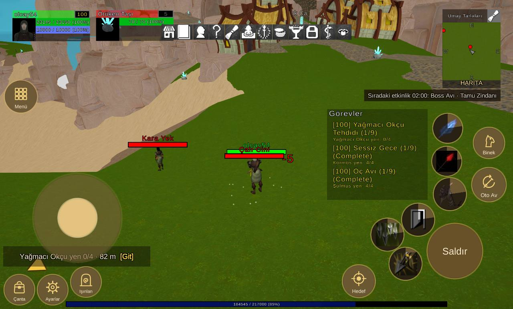

# Arayüz yerleşimi, 2960x1788 ekran

Durum: 🔴 açık

| Tekrar | Cihaz | Sürümler | İlk görülme | Son görülme |
|---|---|---|---|---|
| 1 | 1 | 1.0.79 | 09.10.2026 01:13 | 09.10.2026 01:13 |


## İlk rapor

**Arayüz** · sürüm **1.0.79** · samsung SM-X930 · Android OS 16 / API-36 (BP4A.251205.006/X930XXS8BZH4) · ekran 2960x1788 · UmayTarlalari

### Mesaj
```text
3 çakışma (2960x1788)
```

### Ayrıntı
```text
Ekran 2960x1788, güvenli alan (0,0 2960x1788)
Işınlan kaydırıldı (0, 20)
Beceri2 kaydırıldı (-10, -40)
Beceri3 kaydırıldı (-40, -20)
Beceri4 kaydırıldı (20, -20)
Beceri5 kaydırıldı (20, 0)
Beceri6 kaydırıldı (110, 120)
Çakışmalar (3):
- düğme Beceri7 ~ QuestTrackerWindow (QuestTrackerWindow/Contents/QuestTrackerPanel)
- düğme Beceri3 ~ düğme Beceri8
- FocusUnitFrame | SystemBar  (SystemBar/SystemSettingsButton ~ FocusUnitFrame/ContentPanel/BarPanel)
Düğmeler:
Hareket (190,270 514x514)
Çanta (25,25 174x174)
Ayarlar (217,25 174x174)
Işınlan (409,69 174x174)
Menü (27,1135 188x188)
Saldır (2465,176 319x319)
Beceri1 (2502,571 188x188)
Beceri2 (2319,423 188x188)
Beceri3 (2142,336 188x188)
Beceri4 (2246,168 188x188)
Beceri5 (2493,770 170x170)
Beceri6 (2498,961 170x170)
Beceri7 (2103,545 170x170)
Beceri8 (2022,351 170x170)
Oto Av (2723,621 197x197)
Binek (2732,872 179x179)
Hedef (1977,67 188x188)
Göstergeler:
FocusUnitFrame (554,1551 447x179)
MiniMap (2553,1278 335x456)
PlayerUnitFrame (72,1549 447x179)
QuestTrackerWindow (1887,631 581x525)
SystemBar (931,1558 1097x89)
XPBarPanel (380,11 2199x34)
```

<details><summary>Ortam</summary>

```text
tur: arayuz
surum: 1.0.79
cihaz: samsung SM-X930
sistem: Android OS 16 / API-36 (BP4A.251205.006/X930XXS8BZH4)
grafik: Vulkan / Mali-G925-Immortalis MC12 / bellek 11511 MB
ekran: 2960x1788
ayarlar: kalite 3, çözünürlük 0, gölge 0, fps sınırı 1
sahne: UmayTarlalari
oyuncu: seviye 100
sure: 35 sn
```

</details>

<details><summary>Oyunun durumu</summary>

```text
Sürüm 1.0.79 | samsung SM-X930 | Android OS 16 / API-36 (BP4A.251205.006/X930XXS8BZH4)
Vulkan Mali-G925-Immortalis MC12 | Bellek 11511 MB | 2960x1788 | FPS 94 | Süre 32 sn
Kare süresi: işlemci 12.4 ms | ekran kartı 10.6 ms | ekran 120 Hz | hedef 500 | kalite Ultra | çizim 3840x2320 (ekran 2960x1788, ölçek 1.30) | pil 71%
Sahneler: MovedObjectsHolder UmayTarlalari
Giriş: dokunmatik var | fare bağlı | ekran tuşları açık
Son dokunuş: 2568,348 -> MobileHudCanvas/SaldırButton [MobileHudCanvas 5]
Oyuncu karakteri: oluştu (MecanimMale64) | Önizleme karakteri: …
```

</details>

<details><summary>Son kayıt satırları</summary>

```text
01:12:52 [Warning] [Reklam] onay bilgisi: Publisher misconfiguration: Failed to read publisher's account configuration; no form(s) configured for the input app ID. Verify that you have configured one or more forms for t...
01:12:34 [Log] OyunAyarlari: 4K açıldı (Mali-G925-Immortalis MC12, bellek 11511 MB)
```

</details>


## Ekran görüntüleri



## Görülmeler (yeniden eskiye)

| Zaman · sürüm · cihaz · harita · oyuncu · ekran |
|---|
| 09.10.2026 01:13 · 1.0.79 · samsung SM-X930 · UmayTarlalari · seviye 100 · 2960x1788 |

Anahtar: `arayuz-2960x1788`
