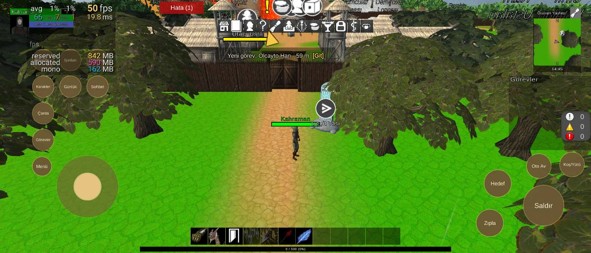
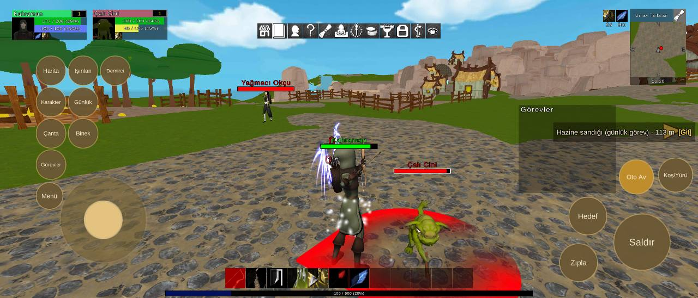
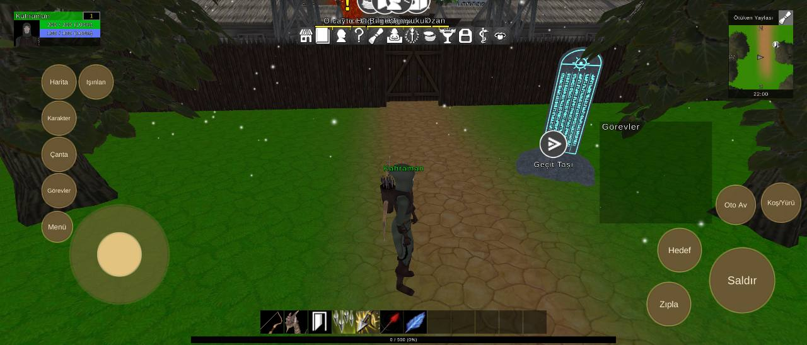
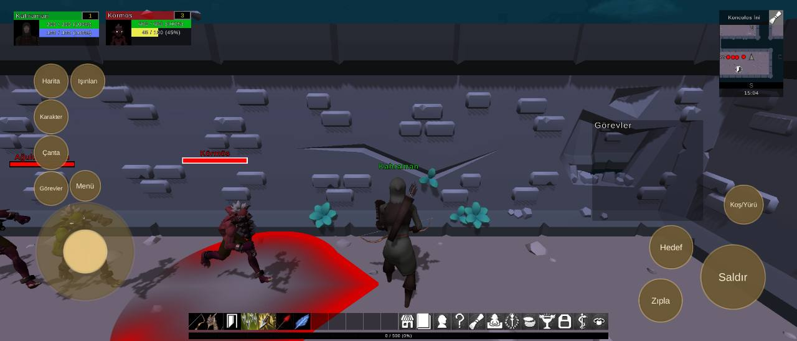

# Arayüz yerleşimi, 3120x1335 ekran

Durum: 🔁 yeniden görüldü

| Tekrar | Cihaz | Sürümler | İlk görülme | Son görülme |
|---|---|---|---|---|
| 4 | 1 | 0.1.17, 0.1.25, 0.1.36, 0.1.43 | 03.10.2026 23:09 | 05.10.2026 00:08 |


## İlk rapor

**Arayüz** · sürüm **0.1.17** · samsung SM-S938B · Android OS 16 / API-36 (BP4A.251205.006/S938BXXSBCZG3) · ekran 3120x1335 · KoncolosIni

### Mesaj
```text
çakışma yok (3120x1335)
```

### Ayrıntı
```text
Ekran 3120x1335, güvenli alan (128,0 2992x1335)
Harita kaydırıldı (60, 0)
Işınlan kaydırıldı (60, 0)
Karakter kaydırıldı (60, 0)
Çanta kaydırıldı (60, 0)
Görevler kaydırıldı (60, 0)
Menü kaydırıldı (140, 90)
Çakışmalar (0):
Düğmeler:
Saldır (2745,125 250x250)
Hareket (142,159 384x384)
Zıpla (2503,75 167x167)
Hedef (2544,284 167x167)
Koş/Yürü (2836,459 150x150)
Harita (135,953 130x130)
Işınlan (279,953 130x130)
Karakter (135,813 130x130)
Çanta (135,673 130x130)
Görevler (135,532 130x130)
Menü (275,549 117x117)
Göstergeler:
AbilityBar (739,43 819x67)
FocusUnitFrame (414,1158 334x134)
MiniMap (2516,955 785x844)
PlayerUnitFrame (53,1156 334x134)
QuestTrackerWindow (2319,471 434x392)
SystemBar (1562,43 819x67)
XPBarPanel (739,8 1642x25)
```

<details><summary>Ortam</summary>

```text
tur: arayuz
surum: 0.1.17
cihaz: samsung SM-S938B
sistem: Android OS 16 / API-36 (BP4A.251205.006/S938BXXSBCZG3)
grafik: Vulkan / Adreno (TM) 830 / bellek 11113 MB
ekran: 3120x1335
ayarlar: kalite 1, çözünürlük 0, gölge 0, fps sınırı 1
sahne: KoncolosIni
oyuncu: seviye 1
sure: 44 sn
```

</details>

<details><summary>Oyunun durumu</summary>

```text
Sürüm 0.1.17 | samsung SM-S938B | Android OS 16 / API-36 (BP4A.251205.006/S938BXXSBCZG3)
Vulkan Adreno (TM) 830 | Bellek 11113 MB | 3120x1335 | FPS 31 | Süre 42 sn
Kare süresi: işlemci 33.3 ms | ekran kartı 14.6 ms | ekran 60 Hz | hedef 60 | kalite Medium | pil 32%
Sahneler: KoncolosIni
Giriş: dokunmatik var | fare bağlı | ekran tuşları açık
Son dokunuş: 2870,129 -> Panel/Kapat [IsinlanmaCanvas 31]
Oyuncu karakteri: oluştu (MecanimMale156) | Önizleme karakteri: yok | Önizleme kamerası: kapalı
```

</details>

<details><summary>Son kayıt satırları</summary>

```text
23:09:14 [Exception] NullReferenceException: Object reference not set to an instance of an object.
23:09:14 [Exception] NullReferenceException: Object reference not set to an instance of an object.
23:09:14 [Exception] NullReferenceException: Object reference not set to an instance of an object.
23:09:14 [Exception] NullReferenceException: Object reference not set to an instance of an object.
23:09:14 [Exception] NullReferenceException: Object reference not set to an instance of an object.
23:09:14 [Exception] NullReferenceException: Object reference not set to an instance of an object.
23:09:14 [Exception] NullReferenceException: Object reference not set to an instance of an object.
23:09:14 [Exception] NullReferenceException: Object reference not set to an instance of an object.
23:09:14 [Exception] NullReferenceException: Object reference not set to an instance of an object.
23:09:14 [Exception] NullReferenceException: Object reference not set to an instance of an object.
23:09:14 [Exception] NullReferenceException: Object reference not set to an instance of an object.
23:09:14 [Exception] NullReferenceException: Object reference not set to an instance of an object.
23:09:14 [Exception] NullReferenceException: Object reference not set to an instance of an object.
23:09:14 [Exception] NullReferenceException: Object reference not set to an instance of an object.
23:09:14 [Exception] NullReferenceException: Object reference not set to an instance of an object.
```

</details>


## Ekran görüntüleri









## Notlar

05.10.2026 00:08: 0.1.19 sürümünde düzeltildi denmişti ama 0.1.43 sürümünde yeniden görüldü (samsung SM-S938B).

05.10.2026 00:08 · 0.1.43 · samsung SM-S938B — Arayüz: 1 çakışma (3120x1335)

```text
Ekran 3120x1335, güvenli alan (128,0 2992x1335)
Koş/Yürü kaydırıldı (0, -50)
Oto Av kaydırıldı (0, -50)
Çakışmalar (1):
- düğme Binek ~ düğme Çanta
Düğmeler:
Saldır (2763,144 213x213)
Hareket (299,187 326x326)
Zıpla (2515,88 142x142)
Hedef (2557,296 142x142)
Koş/Yürü (2956,403 128x128)
Oto Av (2781,395 128x128)
Harita (173,963 111x111)
Işınlan (316,963 111x111)
Demirci (460,963 111x111)
Karakter (173,822 111x111)
Günlük (316,822 111x111)
Binek (188,682 111x111)
Sohbet (460,822 111x111)
Çanta (173,682 111x111)
Görevler (173,542 111x111)
Menü (172,408 99x99)
Göstergeler:
AbilityBar (1007,44 1106x90)
MiniMap (2816,955 250x340)
PlayerUnitFrame (53,1156 334x134)
QuestTrackerWindow (2686,543 434x392)
SystemBar (1150,1163 819x67)
XPBarPanel (739,8 1642x25)
```

04.10.2026 19:07 · 0.1.36 · samsung SM-S938B — Arayüz: çakışma yok (3120x1335)

```text
Ekran 3120x1335, güvenli alan (128,0 2992x1335)
Düğmeler yerinde.
Çakışmalar (0):
Düğmeler:
Saldır (2745,125 250x250)
Hareket (270,159 384x384)
Zıpla (2503,75 167x167)
Hedef (2544,284 167x167)
Koş/Yürü (2945,476 150x150)
Oto Av (2770,467 150x150)
Harita (163,953 130x130)
Işınlan (307,953 130x130)
Demirci (450,953 130x130)
Karakter (163,813 130x130)
Günlük (307,813 130x130)
Binek (307,673 130x130)
Çanta (163,673 130x130)
Görevler (163,532 130x130)
Menü (163,399 117x117)
Göstergeler:
AbilityBar (1007,44 1106x90)
FocusUnitFrame (414,1158 334x134)
MiniMap (2816,955 250x340)
PlayerUnitFrame (53,1156 334x134)
QuestTrackerWindow (2319,471 434x392)
StatusEffectWindow (2696,1212 110x79)
SystemBar (1150,1163 819x67)
XPBarPanel (739,8 1642x25)
```

04.10.2026 11:41 · 0.1.25 · samsung SM-S938B — Arayüz: çakışma yok (3120x1335)

```text
Ekran 3120x1335, güvenli alan (128,0 2992x1335)
Düğmeler yerinde.
Çakışmalar (0):
Düğmeler:
Saldır (2745,125 250x250)
Hareket (270,159 384x384)
Zıpla (2503,75 167x167)
Hedef (2544,284 167x167)
Koş/Yürü (2945,476 150x150)
Oto Av (2770,467 150x150)
Harita (163,953 130x130)
Işınlan (307,953 130x130)
Karakter (163,813 130x130)
Çanta (163,673 130x130)
Görevler (163,532 130x130)
Menü (163,399 117x117)
Göstergeler:
AbilityBar (1007,44 1106x90)
MiniMap (2816,955 250x340)
PlayerUnitFrame (53,1156 334x134)
QuestTrackerWindow (2319,471 434x392)
SystemBar (1150,1163 819x67)
XPBarPanel (739,8 1642x25)
```

## Görülmeler (yeniden eskiye)

| Zaman · sürüm · cihaz · harita · oyuncu · ekran |
|---|
| 05.10.2026 00:08 · 0.1.43 · samsung SM-S938B · FeaturesDemoZone · seviye 1 · 3120x1335 |
| 04.10.2026 19:07 · 0.1.36 · samsung SM-S938B · UmayTarlalari · seviye 1 · 3120x1335 |
| 04.10.2026 11:41 · 0.1.25 · samsung SM-S938B · FeaturesDemoZone · seviye 1 · 3120x1335 |
| 03.10.2026 23:09 · 0.1.17 · samsung SM-S938B · KoncolosIni · seviye 1 · 3120x1335 |

Anahtar: `arayuz-3120x1335`
