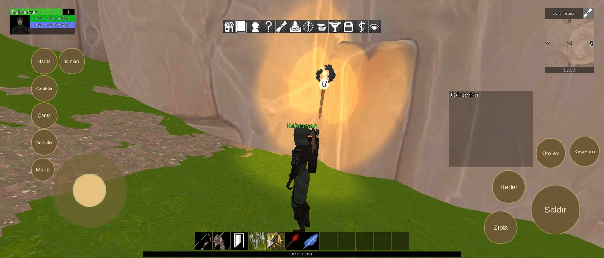

# Oyuncu bildirimi: merhaba

Durum: 🔴 açık

| Tekrar | Cihaz | Sürümler | İlk görülme | Son görülme |
|---|---|---|---|---|
| 1 | 1 | 0.1.25 | 04.10.2026 11:42 | 04.10.2026 11:42 |


## İlk rapor

**Oyuncu bildirimi** · sürüm **0.1.25** · samsung SM-S938B · Android OS 16 / API-36 (BP4A.251205.006/S938BXXSBCZG3) · ekran 3120x1335 · BoruTepesi

### Oyuncunun notu

> merhaba

<details><summary>Ortam</summary>

```text
tur: oyuncu
surum: 0.1.25
cihaz: samsung SM-S938B
sistem: Android OS 16 / API-36 (BP4A.251205.006/S938BXXSBCZG3)
grafik: Vulkan / Adreno (TM) 830 / bellek 11113 MB
ekran: 3120x1335
ayarlar: kalite 2, çözünürlük 3, gölge 3, fps sınırı 1
sahne: BoruTepesi
oyuncu: seviye 1
sure: 86 sn
```

</details>

<details><summary>Oyunun durumu</summary>

```text
Sürüm 0.1.25 | samsung SM-S938B | Android OS 16 / API-36 (BP4A.251205.006/S938BXXSBCZG3)
Vulkan Adreno (TM) 830 | Bellek 11113 MB | 3120x1335 | FPS 128 | Süre 84 sn
Kare süresi: işlemci 16.8 ms | ekran kartı 9.5 ms | ekran 120 Hz | hedef 60 | kalite High | pil 60%
Sahneler: BoruTepesi
Giriş: dokunmatik var | fare bağlı | ekran tuşları açık
Son dokunuş: 1384,727 -> Panel/Gönder [SorunBildirCanvas 32]
Oyuncu karakteri: oluştu (MecanimMale139) | Önizleme karakteri: yok | Önizleme kamerası: kapalı
```

</details>


## Ekran görüntüleri



## Görülmeler (yeniden eskiye)

| Zaman · sürüm · cihaz · harita · oyuncu · ekran |
|---|
| 04.10.2026 11:42 · 0.1.25 · samsung SM-S938B · BoruTepesi · seviye 1 · 3120x1335 |

Anahtar: `oyuncu-b9efbe7a2a`
